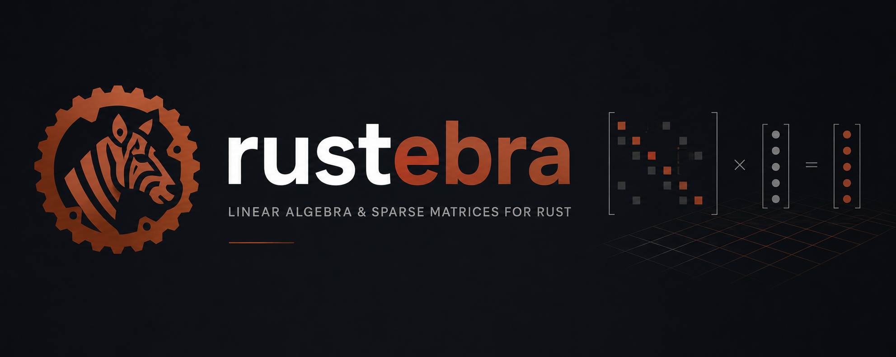

<div style="text-align: center; margin: 2em auto; max-width: 800px;">

**Linear algebra for embedded systems, microcontrollers, and real-time applications.**

A hybrid `no_std`/`alloc` library. Stack-first by default. Scales to sparse matrices and Krylov subspace solvers when a heap is available.

[API Reference](../book/rustdoc/rustebra/index.html) · [Architecture](adr/index.md) · [GitHub](https://github.com/tec-eli/rustebra)

</div>

## Why rustebra exists

Rust currently lacks a linear algebra library that is simultaneously serious about `no_std` support **and** complete enough to cover sparse matrices and iterative solvers. Existing options either assume a heap is always available, or only provide a partial set of operations for constrained environments.

**rustebra closes that gap.**

## Design principles

- **No allocator required by default** — The core works entirely on the stack using const generics to fix sizes at compile time.
- **Allocation is opt-in** — Heap-backed structures and algorithms are available behind the `alloc` feature flag.
- **Generic over numeric precision** — Works across floating-point types, from microcontrollers without double-precision units to desktop systems.
- **Explicit error handling** — Recoverable failures are reported through `Result`, not panics.

## rustebra vs. the competition

| <div style="padding: 8px 0;">Feature</div> | <div style="padding: 8px 0;">rustebra</div> | <div style="padding: 8px 0;">ndarray</div> | <div style="padding: 8px 0;">nalgebra</div> |
|---------|----------|---------|----------|
| <div style="padding: 8px 0;">**no_std support**</div> | <div style="padding: 8px 0;"><span style="background-color: #6cc644; color: white; padding: 2px 6px; border-radius: 3px; font-weight: bold; font-size: 0.85em;">Yes</span><br/>Full</div> | <div style="padding: 8px 0;"><span style="background-color: #d4a024; color: white; padding: 2px 6px; border-radius: 3px; font-weight: bold; font-size: 0.85em;">Partial</span><br/>Optional</div> | <div style="padding: 8px 0;"><span style="background-color: #d4a024; color: white; padding: 2px 6px; border-radius: 3px; font-weight: bold; font-size: 0.85em;">Partial</span><br/>Optional</div> |
| <div style="padding: 8px 0;">**Stack-only (no heap required)**</div> | <div style="padding: 8px 0;"><span style="background-color: #6cc644; color: white; padding: 2px 6px; border-radius: 3px; font-weight: bold; font-size: 0.85em;">Yes</span><br/>Default</div> | <div style="padding: 8px 0;"><span style="background-color: #cb2431; color: white; padding: 2px 6px; border-radius: 3px; font-weight: bold; font-size: 0.85em;">No</span><br/>No</div> | <div style="padding: 8px 0;"><span style="background-color: #6cc644; color: white; padding: 2px 6px; border-radius: 3px; font-weight: bold; font-size: 0.85em;">Yes</span><br/>For fixed-size</div> |
| <div style="padding: 8px 0;">**Sparse matrices**</div> | <div style="padding: 8px 0;"><span style="background-color: #6cc644; color: white; padding: 2px 6px; border-radius: 3px; font-weight: bold; font-size: 0.85em;">Yes</span><br/>v0.3.0+ (COO, CSR, CSC)</div> | <div style="padding: 8px 0;"><span style="background-color: #cb2431; color: white; padding: 2px 6px; border-radius: 3px; font-weight: bold; font-size: 0.85em;">No</span><br/>Separate crate</div> | <div style="padding: 8px 0;"><span style="background-color: #d4a024; color: white; padding: 2px 6px; border-radius: 3px; font-weight: bold; font-size: 0.85em;">Partial</span><br/>Limited</div> |
| <div style="padding: 8px 0;">**Krylov solvers**</div> | <div style="padding: 8px 0;"><span style="background-color: #1f6feb; color: white; padding: 2px 6px; border-radius: 3px; font-weight: bold; font-size: 0.85em;">Planned</span><br/>v0.4.0</div> | <div style="padding: 8px 0;"><span style="background-color: #d4a024; color: white; padding: 2px 6px; border-radius: 3px; font-weight: bold; font-size: 0.85em;">Partial</span><br/>Via ndarray-linalg</div> | <div style="padding: 8px 0;"><span style="background-color: #cb2431; color: white; padding: 2px 6px; border-radius: 3px; font-weight: bold; font-size: 0.85em;">No</span><br/>Not in core</div> |
| <div style="padding: 8px 0;">**3D math/graphics**</div> | <div style="padding: 8px 0;"><span style="background-color: #cb2431; color: white; padding: 2px 6px; border-radius: 3px; font-weight: bold; font-size: 0.85em;">No</span><br/>Not focused</div> | <div style="padding: 8px 0;"><span style="background-color: #cb2431; color: white; padding: 2px 6px; border-radius: 3px; font-weight: bold; font-size: 0.85em;">No</span><br/>Not provided</div> | <div style="padding: 8px 0;"><span style="background-color: #6cc644; color: white; padding: 2px 6px; border-radius: 3px; font-weight: bold; font-size: 0.85em;">Yes</span><br/>Excellent</div> |
| <div style="padding: 8px 0;">**BLAS/LAPACK integration**</div> | <div style="padding: 8px 0;"><span style="background-color: #cb2431; color: white; padding: 2px 6px; border-radius: 3px; font-weight: bold; font-size: 0.85em;">No</span><br/>No</div> | <div style="padding: 8px 0;"><span style="background-color: #6cc644; color: white; padding: 2px 6px; border-radius: 3px; font-weight: bold; font-size: 0.85em;">Yes</span><br/>Excellent</div> | <div style="padding: 8px 0;"><span style="background-color: #cb2431; color: white; padding: 2px 6px; border-radius: 3px; font-weight: bold; font-size: 0.85em;">No</span><br/>Pure Rust</div> |
| <div style="padding: 8px 0;">**Maturity**</div> | <div style="padding: 8px 0;"><span style="background-color: #e0ad4e; color: white; padding: 2px 6px; border-radius: 3px; font-weight: bold; font-size: 0.85em;">Early</span><br/>v0.3.0</div> | <div style="padding: 8px 0;"><span style="background-color: #6cc644; color: white; padding: 2px 6px; border-radius: 3px; font-weight: bold; font-size: 0.85em;">Yes</span><br/>Mature</div> | <div style="padding: 8px 0;"><span style="background-color: #6cc644; color: white; padding: 2px 6px; border-radius: 3px; font-weight: bold; font-size: 0.85em;">Yes</span><br/>Mature</div> |
| <div style="padding: 8px 0;">**Embedded systems**</div> | <div style="padding: 8px 0;"><span style="background-color: #6cc644; color: white; padding: 2px 6px; border-radius: 3px; font-weight: bold; font-size: 0.85em;">Yes</span><br/>Best choice</div> | <div style="padding: 8px 0;"><span style="background-color: #cb2431; color: white; padding: 2px 6px; border-radius: 3px; font-weight: bold; font-size: 0.85em;">No</span><br/>Poor fit</div> | <div style="padding: 8px 0;"><span style="background-color: #d4a024; color: white; padding: 2px 6px; border-radius: 3px; font-weight: bold; font-size: 0.85em;">Partial</span><br/>For fixed-size only</div> |

## When to use rustebra

**Use rustebra if:**
- You need linear algebra **without dynamic allocation** (embedded, real-time, microcontroller)
- You're working with **sparse matrices** in an embedded context
- You want **no_std + optional alloc** (best of both worlds)
- You need predictable **stack-only memory**

**Use ndarray if:**
- You need **production BLAS/LAPACK** routines (scientific computing, data science)
- You're comfortable with **heap allocation** and want optimal performance
- You need **large matrices** with sophisticated solvers
- Building NumPy-like workflows in Rust

**Use nalgebra if:**
- You need **3D graphics, robotics, or game engine** math (Points, Isometries, Rotations)
- You want **optional no_std support** with fixed-size matrices
- Building low-level geometric transformations

## Getting started

```toml
[dependencies]
rustebra = "0.3.1"

# Optional: heap-backed structures and Krylov solvers
rustebra = { version = "0.3.1", features = ["alloc"] }
```

```sh
# no_std build (default)
cargo build
cargo test

# with alloc feature
cargo build --features alloc
cargo test --features alloc
```

## Explore the docs

- **[API Reference](../book/rustdoc/rustebra/index.html)** — generated from `cargo doc`
- **[Algorithms](algorithms/index.md)** — mathematical reference for every algorithm
- **[Architecture Decisions](adr/index.md)** — design choices and trade-offs
- **[Contributing Guide](https://github.com/tec-eli/rustebra/blob/main/CONTRIBUTING.md)** — how to get involved

Licensed under the [Apache License 2.0](https://github.com/tec-eli/rustebra/blob/main/LICENSE.md).
